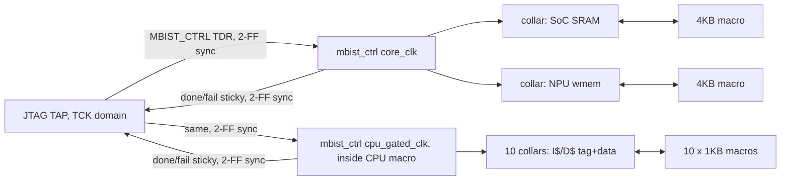
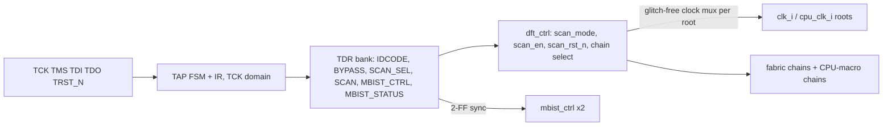

# DFT Architecture: scan + MBIST + JTAG for the Sky130 SoC (Stage 0)

Bead `j41m.1` (epic `j41m`), GH #244. Scope: Sky130 only (`pnr/sky130/soc/`, `pnr/sky130/cpu/`). No RTL, flow, macro or
LibreLane-install change was made. Experiments live in `/nobackup/claude_sim_build/dft_stage0/`; the reproducible
scripts are in `tools/dft/` (see its README).

**Evidence labels.** Every statement carries one: **[M]** measured (command and output named), **[R]** read from source
(`file:line`), **[A]** assumed or estimated (reasoning given). Where a source said something that a measurement
contradicted, the measurement is reported and the conflict is called out.

## 0. Decisions already taken (2026-10-10)

These are **DECIDED** by the project owner and are not open questions. The rest of the document is written against them.

| # | Decision | Consequence in this document |
|---|---|---|
| 1 | **Goal is real tape-out intent on Sky130.** DFT must be production-usable. | A stuck-at coverage target is stated and justified (section 2.1). Patterns must reach a tester (section 2.3). Section 2.4 lists what the open-source tools cannot deliver. |
| 2 | ATPG tools may be added to **this repo's `flake.nix` devshell only**. Non-commercial-licensed tools (Atalanta) are acceptable. | Licence text quoted in section 2.2. A tape-out with commercial intent changes this and is flagged there. |
| 3 | **Crypto key registers are EXCLUDED from scan.** | Quantified and enforced in section 7, with a check script that fails on violation. Exclusion alone leaks the key; masking is required (section 7). |
| 4 | **MBIST is tester-only.** No APB register, no power-on auto-run, no firmware visibility. | The APB-slot analysis was dropped. MBIST is started and read only through the TAP (decision 5). |
| 5 | **Test access is an IEEE 1149.1 JTAG TAP** controlling both scan and MBIST. | The TAP is a Stage 1 deliverable, not an optional last stage (sections 9, 10). |
| 6 | **Pad ring / chip top is NOT in scope now.** | The core macro exposes the TAP and any unavoidable raw ports. Section 9.5 lists what a future chip-top epic needs. |

## 1a. Summary

| Q | Headline | Basis |
|---|---|---|
| 1 Scan tool | The Sky130 flow's OpenROAD **does** have a `dft` module and stitched a legal chain on a real block (`timer`, 178 flops) and on the whole synthesised SoC fabric (18,752 flops, 5 s). It honours `set_dont_touch` (needed for decision 3). It has real defects (below). No lock-up latches, no clock-gate/test-enable handling, no macro scan pins. **Usable for stitching, with workarounds.** | [M] |
| 2 ATPG | Nothing was installed. Quaigh 0.0.6 (MIT/Apache, Rust, SAT) built and ran: **92.41 % raw (4336/4692), 358 patterns, 1.5 s** on the full-scan cut of `timer` (generic-gate model, not Sky130 cells). No tool is proven at SoC scale, and **none of them delivers production-grade ATPG** (section 2.4). | [M] / [A] |
| 3 RTL audit | 18,753 sequential cells in the fabric + 4,829 inside the CPU macro. One live clock gate (no test enable), one latch, no RTL negedge flops, no tri-states, no comb loops, no ring oscillator in the build. ~20 Stage 1 changes (section 4). | [M]/[R] |
| 4 Hard macros | The CPU is a hard macro with **no scan or test pins**; 4,829 flops are invisible to SoC-level insertion. ~6-7 h per CPU+SoC re-harden round. | [R]/[A] |
| 5 MBIST | 12 SRAM macros (2 x 4 KB in the fabric, 10 x 1 KB inside the CPU macro), 147,456 bits. March C- (10N): 10,240 cycles fabric / 2,560 cycles CPU in parallel = 256 us at 40 MHz. Two controllers, driven and read through the TAP. | [R] + [A] |
| 6 Crypto | DECIDED: exclude. 256 flops (1.37 % of flops). **Unmasked, the exclusion costs ~11 % of the fault universe and still leaks the key**; masking brings it to ~0.7 %. | [M] |
| 7 Cost | Scan flops +117,350 um2 fabric (+10.2 % of synthesised stdcell, ~+0.6 pp utilisation), +30,209 um2 CPU macro. D-pin setup +0.07 to +0.45 ns by corner. | [M] area/setup |
| 8 Access | DECIDED: JTAG TAP. Raw ports: TCK, TMS, TDI, TDO, TDO-enable, optional TRST_N. | decision |

**Go/no-go:** Stage 1 (TAP + scan-ready RTL) GO. Stage 2 CONDITIONAL GO. Stage 3 CONDITIONAL: GO for a time-boxed tool spike, NO-GO for a promised production coverage number until the spike passes. Stage 4 (MBIST) GO. Details in section 11.

## 1. Scan insertion tool

### 1.1 Which OpenROAD
The task brief expected `openroad-2026-02-17`. **[M]** The Sky130 flow does not use it. `nix-shell` in the LibreLane checkout
(`shell_probe.log`) puts `openroad` at `/nix/store/784j83yn...-openroad-python3-3.11.9-env/bin/openroad`, reporting revision
`edf00dff99f6c40d67a30c0e22a8191c5d2ed9d6`. This matches `pnr/Makefile:112-136` [R], which says Sky130 and FreePDK45 are
deliberately **not** overridden and only ASAP7 uses 26Q2. Three builds are on this host:

| Build | Revision | DFT commands [M: `tools/dft/help_probe.tcl`] |
|---|---|---|
| LibreLane devshell (**Sky130 flow**) | `edf00dff...` | `set_dft_config`, `report_dft_config`, `preview_dft`, `insert_dft`, `scan_replace` |
| `openroad-2026-02-17` | `dcf36133...` | `set_dft_config`, `report_dft_config`, `report_dft_plan`, `execute_dft_plan`, `scan_replace`, `scan_opt` |
| `openroad-26Q2` | `26Q2` | same as 2026-02-17 |

`set_dft_config` options: `edf00dff`: `-max_length -max_chains -clock_mixing`. 26Q2 adds `-scan_enable_name_pattern
-scan_in_name_pattern -scan_out_name_pattern`. Valid `-clock_mixing` values are `no_mix` and `clock_mix`; `mix` raises DFT-0006 and
**aborts the process with a stack trace** [M: `toy_edf.log`].

### 1.2 Real-block experiment [M]
`timer` (+ `apb4_register_bank`) -> sv2v -> Yosys 0.46 `synth -flatten; dfflibmap; abc` against `sky130_fd_sc_hd__tt_025C_1v80.lib`
(`tools/dft/synth.ys`) -> 891 cells, 178 `dfxtp_1`. Then `scan_replace; preview_dft; insert_dft` (`tools/dft/dft_timer.tcl`):

- Result: 178 `dfxtp_1` became 178 `sdfxtp_1`, one chain of 178, new ports `scan_enable_1`, `scan_in_1`, `scan_out_1`.
- `tools/dft/chain_check.py` walked the netlist: chain length 178, 0 unreached flops, 0 non-scan flops left, one SCE net, one clock net.
- The scan netlist re-reads and links in OpenROAD (891 cells). It also reads and times in OpenSTA.
- **Not done:** functional-mode equivalence and a shift/flush simulation. The chain was checked structurally only.
- Whole fabric, `RUN_2026-10-06_22-43-34/04-yosys-synthesis/soc_top.nl.v` (91,424 cells) with the real CPU and SRAM LEFs/libs
  (`tools/dft/soc_dft.tcl`): `scan_replace` plus `insert_dft` took **5 s**. 17,903 `dfxtp_2` -> `sdfxtp_2`, 843 `dfrtp_2` ->
  `sdfrtp_2`, 6 `dfstp_2` -> `sdfsbp_2`, the 1 latch (`dlxtn_1`) left alone. With `-max_chains 4 -clock_mixing no_mix` it made
  **8 chains**: four of 235-236 flops on `cpu_clk_i` (944 flops) and four of 4,450-4,453 on `clk_i` (17,809). So `-max_chains` is per clock
  domain, and the CPU-domain flops are only the 173 + 771 outside the macro.

### 1.3 What the module cannot do, and the defects found

| Capability | Result |
|---|---|
| Multiple clock domains | Groups by (clock, edge) in `no_mix`. In `clock_mix` it stitches rising/falling and different clocks into **one chain with no lock-up latch** (toy: `fn0` falling clka -> `fb1` rising clkb -> `fg0` -> ...). [M `toy_edf.log`] Use `no_mix` only. |
| Lock-up latches | None inserted (no `dlx*` cell added in the toy; the only latch in the output is the one that was in the input). [M] |
| Clock gates | A gated flop's clock is traced through the gate to the root clock (`fg0` joined clka's chain). The gate itself is **not** scan-replaced (`DFT-0002`) and no test-enable is driven. A library `dlclkp` has an `sdlclkp` equivalent in the Liberty but the tool does not use it. [M] |
| Latches | Skipped with a warning, left unscanned (`DFT-0002/0007`). [M] |
| Negedge flops | Own chain in `no_mix`. **Defect, edf00dff only:** `dfrtn_1` was replaced by `sdfbbn_1` (set+reset flop) and its `SET_B` pin is **left unconnected**; 26Q2 picks `sdfrtn_1` correctly. [M `toy_scan_edf.v`, `toy_scan_26q2.v`] |
| `report_dft_config` | Fails with a Tcl error (`can't read "args"`) on edf00dff. [M] |
| Chain count/balancing | Chain count follows the clock-domain count; `-max_chains` below the domain count is not honoured (toy: asked 2, got 3). The 8-chain fabric result is 236 vs 4,453, unbalanced. `-max_length` was not shown to split anything. [M] |
| Scan-enable | One `scan_enable_N` port, **one net with 18,752 sinks, unbuffered**. No buffer tree. [M] |
| Hard-macro scan pins | Macro instances are ignored (not scan cells). A chain through a macro cannot be built by the tool. [M: CPU/SRAM macros untouched] |
| Netlist legality | `write_verilog` emits `assign scan_out_N = <internal net>` for each scan-out (8 assigns in the SoC; the input netlist had 0). `Checker.NetlistAssignStatements` runs at flow step 06 and would object if the insertion ran before it. [M] |
| DEF `SCANCHAINS` | **Not tested.** [A] Assume absent: no command in either build writes it, and the module has no scan-def API. |
| `set_dont_touch` | **Honoured** by `scan_replace` and the stitcher (256 marked flops stayed `dfxtp_2` and off the chains). Needed for decision 3. [M `soc_excl.log`] |
| Reset/set handling in shift | Not handled. Async resets stay functional, so any internally generated reset can corrupt a chain in shift (section 4). |

### 1.4 Alternatives (not exercised)
- **Yosys-level replacement**: Yosys `dfflibmap` warned `Found unsupported expression 'D&!SCE|SCD&SCE'` on every Sky130 `sdf*` cell [M],
  so it cannot map to scan flops from Liberty; you would hand-write a techmap. More work than the OpenROAD route for no gain.
- **Fault's chain stitcher** (`fault chain`): Swift, not built [A]. It also produces boundary-scan registers. Held in reserve.
- **Recommendation:** OpenROAD `dft` with `no_mix`, run from the **26Q2 binary on the Verilog netlist** (bug-free `sdfrtn_1` choice, name
  patterns), with the chain count set explicitly. Netlist-level avoids reading an ODB written by a different OpenROAD build [A: ODB
  schema compatibility across builds is not guaranteed; not tested].

### 1.5 Slotting into LibreLane as a project-local plugin
The existing plugin `pnr/sky130/soc/plugin/librelane_plugin_cvt_sky130/__init__.py` registers `Step` subclasses and activates them
through `meta.substituting_steps` [R]. Classic's step list is `librelane/flows/classic.py` (`Yosys.Synthesis`,
`Checker.YosysUnmappedCells`, ..., `Checker.NetlistAssignStatements`, `OpenROAD.CheckSDCFiles`, ..., `OpenROAD.Floorplan` ...) [R]; the
Sky130 run's own order (steps 04-21) is `Yosys.Synthesis` 04, `Checker.*` 05-06, `OpenROAD.STAPrePNR` 09, `OpenROAD.Floorplan` 10,
tap/PDN 14-18, global placement skip-IO 20, `OpenROAD.IOPlacement` 21 [M: step directory names in `RUN_2026-10-09_06-18-39`].
`substituting_steps` only replaces a step, so adding one needs a plugin-registered `Flow` subclass of `Classic` with `Steps` edited [A:
not tried; the `SequentialFlow` class exposes `Steps` as a plain list].

| Option | Where | For | Against |
|---|---|---|---|
| **N (recommended)** netlist step | after `Checker.NetlistAssignStatements` (06), before `STAPrePNR` | any OpenROAD build; ports exist before IO placement; no ODB version coupling | must remove or accept the `assign` lines |
| O ODB step | after `OpenROAD.Floorplan` (10), before IO placement (21) | native ODB, no netlist re-read | pinned `edf00dff` only (SET_B defect, no name patterns) |

What breaks downstream [A, except where noted]:
- **SDC**: the single functional SDC has no `scan_enable`/`scan_mode` constraint. Needs `set_case_analysis 0` for functional timing (or a
  false path), plus a separate shift-mode check. `cpu_clk_i` has **no `create_clock`** in `sky130_soc.sdc` today [R: audit; the file defines
  only `core_clk` at `:237`], so CPU-domain flops are unconstrained in the current SoC signoff. This must be fixed before scan timing means anything.
- **Hold**: every chain link is Q -> SCD with no logic. Sky130 `GRT_RESIZER_HOLD_SLACK_MARGIN` is 0.3 ns [R: PD history], so expect a
  hold-buffer count proportional to chain links (18.7 k). Not measured; this is the largest unknown in Stage 2.
- **CTS**: unchanged sink count; the gated-clock structure is the same. The scan-enable net needs a buffer tree (resizer/`repair_design`).
- **Antenna and `e45j`**: one new net with ~18.8 k pins plus 8-12 long scan-out/in nets. The repair-design steps (`CVT.RepairDesignPostGRT`) and
  the diode-on-port step will see new nets; slew/cap/antenna counts must be re-compared against the Gate B and `rccal` baselines.
- **Cell policy**: the flow's resizer must be allowed to keep `sdf*` cells. Whether the PDK `DONT_USE_CELLS` list contains them was **not
  verified** (I could not locate the list in `resolved.json`).

## 2. ATPG tool, coverage target, pattern export

### 2.1 Coverage target (DECIDED basis: tape-out intent) [A]

**Target: stuck-at test coverage >= 99.0 % of the scanned-domain fault list, and stuck-at fault coverage >= 98.0 % of the whole-SoC fault list,
with every exclusion itemised.** Test coverage = detected / (total - proven untestable); fault coverage = detected / total.

Why 99.0 %: the DFT orchestrator's own sign-off criterion in this repo is `saf_coverage_pct >= 99.0` [R: dft-orchestrator contract], and the
standard Williams-Brown estimate shows what lower numbers cost. Defect level DL = 1 - Y^(1-T) for yield Y and coverage T
(arithmetic computed here, but **Y is assumed**; no Sky130 yield data for this die exists in the repo):

| T (stuck-at) | DL at Y=0.8 (ppm) | DL at Y=0.5 (ppm) |
|---|---|---|
| 95 % | 11,095 | 34,064 |
| 98 % | 4,453 | 13,767 |
| 99 % | 2,229 | 6,908 |
| 99.5 % | 1,115 | 3,460 |
| 99.9 % | 223 | 693 |

Reading: even 99 % is thousands of ppm, which is **not** production-grade for a volume product (that needs ~99.5 %+ plus transition and
functional tests). It is a reasonable floor for a low-volume MPW-class die, where every part is also functionally tested. 98 % is the
minimum I would accept, and only with itemised exclusions. The model is stuck-at only: **delay defects are not covered** (section 2.4).

Budget: the 1 % gap between 100 % and 99 % is nearly consumed by the already-decided exclusions: crypto keys ~0.7 % with masking [M proxy, section 7],
TAP flops (~100-300 flops plus their cone, not on any chain) ~0.2-0.4 % [A]. Therefore **SRAM-boundary shadowing (section 6.3) and key masking are both
mandatory to hit the target**; without them the number is ~89 %.

### 2.2 Tools, licences, packaging

| Tool | Licence | Packaging | Maintenance | Scale evidence |
|---|---|---|---|---|
| **Quaigh** 0.0.6 (Coloquinte/quaigh) | MIT OR Apache-2.0 [M: `gh api`] | crates.io. `cargo install` needs OpenSSL headers because `rustsat-kissat` fetches Kissat at build time. Built here with a throwaway `CARGO_HOME` (`tools/dft/build_quaigh.sh`). | last push 2026-02-02, 53 stars [M] | 2.9 k gates, 1.5 s [M]. Larger **unmeasured**. |
| **Fault** (AUCOHL) | Apache-2.0 for Fault itself [M: Readme] | Swift 5.6; ships `flake.nix`, `default.nix`, `nix/atalanta.nix`, `nix/podem.nix` [M: repo tree]. **Not built here.** | last push 2025-08-30, release 0.9.4 on 2025-05-28, 206 stars [M] | Own engine = pseudo-random patterns + fault simulation through iverilog (`atpg.swift` references `iverilogExecutable`) [R]; algorithmic back ends are Atalanta/PODEM. SoC scale unknown. |
| **Atalanta** (hsluoyz/atalanta, from Virginia Tech) | See quote below. GitHub reports no licence file (`license: null`) [M]. Fault's `nix/atalanta.nix` marks it `licenses.unfree` [M]. | Plain C, built from rev `a8e07fe` by Fault's nix file | last push 2024-05-07 [M] | ISCAS-class circuits [A] |
| **PODEM** (via Fault) | Fault's Readme, below | via Fault's nix file | not checked | ISCAS-class [A] |

**Licence text, verbatim.** Atalanta README: "The source code is released for teaching and research use only. Any publication in which ATALANTA was used
to obtain the results should cite the reference given below. ... This program, or any derivative thereof, may not be reproduced nor used for any commercial product
without a written permission form from Prof. Dong S. Ha. For commercial use of ATALANTA ... please contact to Prof. Dong S. Ha" [M: `gh api repos/hsluoyz/atalanta/readme`].
Fault Readme: "SOFTWARE INCLUDED WITH SOME FAULT DISTRIBUTIONS, I.E. ATALANTA AND PODEM, WHILE FREE TO DISTRIBUTE, ARE PROPRIETARY, AND MAY NOT BE USED FOR COMMERCIAL PURPOSES." [M].

**Flag (decision 2 and decision 1 interact).** The owner accepted non-commercial tools. Atalanta's grant is "teaching and research use only"; patterns it
generates for a die that is sold, or taped out with commercial intent, are arguably a use "for a commercial product" and need written permission. This is a
legal reading I cannot settle. If the tape-out becomes commercial, Atalanta/PODEM must be dropped or licensed; **keep Quaigh/Fault's own engine as the
licence-clean path** so the flow does not depend on Atalanta. Installing: add the tools to a new devshell in this repo's `flake.nix` (existing shells: `default`, `bench`, `hls`
at `flake.nix:161,229,250` [R]); nothing system-wide. Not done in Stage 0 (no flake edit was made).

**Measured run (Quaigh).** `tools/dft/cut.ys` makes a full-scan combinational cut of `timer` (`dffunmap; expose -evert-dff; abc` to
AND/NAND/OR/NOR/XOR/XNOR/MUX, written as BLIF): 554 inputs, 976 outputs, 2,925 gates. `quaigh atpg timer_cut.blif -o timer.test`:
> Generated 128 random patterns, detecting 2547/4692 faults (54.28 % coverage) ... Generated 6528 patterns total, detecting 4336/4692 faults (92.41 % coverage) ... Kept 358 patterns, detecting 4336/4692 faults (92.41 % coverage)

It also reported `unobservable=351`. **[A]** If those are proven-redundant faults, test coverage would be 4336/(4692-351) = 99.88 %; I did not verify that reading.
Caveats: the fault universe is generic gates after `abc`, not Sky130 cell pins; the cut ignores the scan path (no shift/flush test, no SCE/SCD faults);
clocks and resets are plain inputs; no cell-library awareness, no fault dictionary, no tester format. Quaigh offers `--num-cycles` for sequential random patterns only.

### 2.3 Pattern export to a tester (decision 1)

Patterns are driven through the TAP (decision 5), so the natural exchange format is **SVF** (Serial Vector Format: `SIR`/`SDR`/`RUNTEST`), which JTAG controllers
and, I believe, OpenOCD can play [A: not verified here]. Plan: (1) ATPG gives pseudo-primary-input/output vectors for the full-scan cut; (2) a **project script**
maps them onto chain order (the `chain_check.py` walk gives the order) and emits SVF plus a cocotb/Verilator replay of the same TAP sequence on the gate-level netlist;
(3) the test house or a project converter produces STIL (IEEE 1450) / WGL for a production ATE. **No open-source tool here does (2) or (3)**; both are glue to be written. [A]

### 2.4 What the open-source tools cannot deliver (strict list, tape-out context) [A unless noted]

- **No scan DRC tool.** Nothing checks, in the commercial sense, clock-as-data, reset controllability, X sources, bus contention, latch transparency. Stage 1 must carry its own netlist checks (`tools/dft/chain_check.py` and `check_scan_exclusions.py` are the start).
- **No transition / at-speed ATPG, no path-delay.** Quaigh and Fault target stuck-at. Delay defects in the 40 MHz core are untested by scan; only the functional test and MBIST (which runs at `core_clk` speed) exercise speed.
- **No pattern compression (EDT-style), no diagnosis, no fault dictionary.** Test time grows linearly with pattern count (section 8).
- **No clock-domain-aware capture sequencing** for two asynchronous domains with a clock gate; the capture protocol (which domain pulses when) is hand-written.
- **No clock-gate / latch modelling.** `en_latch` and the gate are untested structures (section 4 item 5).
- **No X-masking engine** beyond what the cut makes explicit; SRAM outputs and the unscanned TAP/key flops must be made X-free by design (sections 6.3, 7).
- **No guarantee of correlation between gate-level fault coverage and the Sky130 cell netlist.** Measured coverage on a generic-gate cut is an approximation; the final number must be re-simulated on the real netlist with Sky130 models.
- **Scale unproven.** Whether a SAT-based generator finishes on a ~20 k-flop cut (a few hundred thousand gates [A]) is unmeasured.

Plainly: **no tool available here is credible at SoC scale today for a signed production coverage number.** The honest fallback if the Stage 3 spike fails is scan with
chain-integrity tests plus partial coverage on blocks that do complete, reported per block, not as one SoC number.

## 3. Memory inventory

### 3.1 Hard macros (12 instances, 147,456 bits = 18 KiB)

| Instance | Macro | Words x bits | Ports | Clock | Where |
|---|---|---|---|---|---|
| `u_sram.u_sram_macro` | `sky130_sram_4kbyte_1rw1r_32x1024_8` | 1024 x 32 | 1RW + 1R | `core_clk` | SoC fabric |
| `u_npu.g_on.u_wmem.u_sram_macro` | same | 1024 x 32 | 1RW + 1R, port 1 tied off | `core_clk` | SoC fabric |
| icache `u_tag_sram` + 4 x `gen_data_sram` | `sky130_sram_1kbyte_1rw1r_32x256_8` | 256 x 32 each (5) | 1RW + 1R, port 1 tied off | `cpu_gated_clk` | **inside CPU macro** |
| dcache `u_tag_sram` + 4 x `gen_data_sram` | same | 256 x 32 each (5) | same | `cpu_gated_clk` | **inside CPU macro** |

Sources: macro instances [M: `grep` on `soc_top.nl.v:659127,659179,659192`; `design__instance__count__macros = 3` in
`62-cvt-maxcapviolations/state_out.json`], CPU-internal SRAMs [R: `pnr/sky130/cpu/macro_placement.cfg`, 10 instances], wrapper `ifdef` arms [R]:

| Wrapper | `SRAM_SKY130` arm | Other arms |
|---|---|---|
| `rtl/soc/sram_controller.sv` | macro `:856-881`, 2-entry skid read FSM `:663-854` | default: flat 32 K-flop array `:146-148` (no ASAP7 macro arm) |
| `rtl/npu/npu_weight_mem.sv` | one 4 KB macro `:85-104` | `SRAM_ASAP7` 4 x 256x32 behind `rv32i_clock_gate` `:119-129`; default FreePDK45 `:130-139` |
| `rtl/mem/rv32i_icache.sv` / `rv32i_dcache.sv` | tag `:82-95` / `:105-118`; data x4 `:130-143` / `:153-166` | `elsif SRAM_ASAP7`, `else` FreePDK45 |

Macro interface [M: `grep PIN` on the LEF, 127 pins]: port 0 `clk0 csb0 web0 wmask0[3:0] addr0[9:0] din0[31:0] dout0[31:0]`, port 1 `clk1 csb1 addr1[9:0] dout1[31:0]`.
Both `dout` are negedge-launched (Liberty `falling_edge`, clk-to-q 0.336 / 0.365 / 0.481 ns) [R]. The sim model used by cocotb
(`sim/sky130_sram_4kbyte_1rw1r_32x1024_8.sv`) captures inputs on posedge and acts on negedge [R]. **No spare rows/columns**: pass/fail only.
Functional port use: the SoC SRAM writes on port 0 and reads on **port 1** (`dout0` unused, `sram_controller.sv:856-881`); NPU and caches read on port 0.

### 3.2 Not hard macros but memory-like (flops)
8,192-flop `dma_engine.linebuf` (`:318`), 944-bit `cdc_gray_fifo.mem_q`, UART/SPI/I2C/TRNG FIFOs, SHA `w_q`, NPU `ain_q/aout_q`, regfile 992 flops
inside the CPU macro, cache valid/dirty arrays (256 flops each) [M for the totals, R for locations]. These are scanned as ordinary flops; they do not need MBIST.
`boot_rom.mem` folds to constant zero under `__pnr__` [R `boot_rom.sv:105-122`; not present in the netlist].

## 4. Scan-readiness audit (source reading plus netlist counts)

Measured flop census, `RUN_2026-10-09_06-18-39/04-yosys-synthesis/reports/stat.rpt` [M]: `dfxtp_2` 17,903 (no reset), `dfrtp_2` 843
(async reset to 0), `dfstp_2` 6 (async set), `dlxtn_1` 1; **18,753 sequential cells, 855 with async reset/set**. CPU macro
(`rv32i_cpu_top.nl.v.gz`): **4,829 `dfxtp`, 0 reset flops, 0 latches** [M]. By group (Q-net-name attribution; totals exact, split
approximate): DMA ~9,012 (8,192 linebuf), CRYPTO ~3,008, NPU ~1,169, `u_cpu_axi_cdc` ~1,044, I2C ~621, TRNG ~515, bus ~507, GPIO ~352.
Sky130 build facts [R]: CPU is a blackbox (`rv32i_cpu_top_stub.sv`), GPU is a tie-off, `pll_clkgen_stub` is a pure passthrough
(`assign out_clk_o = ref_clk_i`), `USE_ICG_CELL` is not set, `trng_ro_sky130.sv` is not in the build (the TRNG is an LFSR, `trng_lfsr_entropy.sv`).

| # | Item | Where | What it is | Stage 1 must |
|---|---|---|---|---|
| 1 | Scan ports | `soc_top.sv:196-261` | none exist (35 ports / 266 bits [M]) | add `scan_mode_i`, `scan_en_i`, `scan_rst_ni`, `scan_in_i[C]`, `scan_out_o[C]`; update `soc_top_ports.v` and IO config |
| 2 | Tie-offs | `soc_top.sv:288-289` | `SCAN_MODE_TIE_OFF=0`, `SCAN_RST_TIE_OFF=1`, 6 sites / 12 connections | replace with the ports (sites: `:647`, `:707`, `:1021`, `:1248`, `:2076`, `:2182`) |
| 3 | `cdc_reset_sync` hook | `cdc_reset_sync.sv:82,128` | mux is on the **input** of the sync chain only; `rst_n_o = sync_q[...]` is a scan-chain flop that toggles during shift and would pulse every downstream async reset (262+83+133+56+... flops) | move/add the mux to the **output**; 10 instances |
| 4 | `cdc_2ff_sync` | `cdc_2ff_sync.sv:151-177` | async reset from raw `rst_n_i`, no hook; ~60 instances (GPIO 32, FIFO pointers, 4 in `soc_top`) | add `scanmode_i/scan_rst_ni` |
| 5 | Clock gate | `rv32i_clock_gate.sv:13-27`; users `soc_top.sv:2320` (live), `:2321` (GPU, dead), caches/NPU (ASAP7 arm only) | latch + AND, no test enable; `ICGx1` arm hard-ties `SE=1'b0` | add `test_en`, `en_latch` input = `en | test_en`; tie `.SE(test_en)` in the ICG arm. **One** live site on Sky130 |
| 6 | Latch | `rv32i_clock_gate.sv:24` | the only `always_latch` in `rtl/`; `dlxtn_1` in netlist | none beyond item 5; ATPG must treat it as a clock-gate latch |
| 7 | Resets | `pll_subsystem.sv:97,100`, `soc_top.sv:826`, `async_axi_fifo.sv:167`, `apb_cdc_bridge.sv:~325` | `core_rst_n = rst_n_i & pll_locked`, `pll_rst_n = rst_n_i & pll_enable` (an APB register), `cpu_domain_rst_n` = AND of 3 flop-derived resets, `wdt_cpu_rst_req_q`, PMU resets. Only `rst_n_i`/`cpu_rst_n_i` are real pins; all others are flop- or register-driven | in scan mode force every internal async reset inactive (mux with `scan_rst_ni`) at the *net* feeding the flops, not at a sync input |
| 8 | PLL stub | `pll_clkgen_stub.sv:55,69` | passthrough clock, async-reset lock counter | make `locked_q` controllable; a real PLL (Phase 7) will need a test-clock bypass. **Not needed while it is a stub** |
| 9 | Two domains | see below | `clk_i` 17,809 flops, `cpu_clk_i` 173, `cpu_gated_clk` 771 + 4,829 macro [M] | separate chains per domain, no `clock_mix`; add `create_clock cpu_clk_i` to the SDC |
| 10 | `cdc_gray_fifo` | `cdc_gray_fifo.sv:191-199` | no-reset `mem_q` (944 bits) read combinationally across domains | ATPG capture constraint or a lock-up element at the read path |
| 11 | `apb_cdc_bridge` | `:549,649,716` | async-reset toggle handshakes, 3 instances | reset override; chains per side |
| 12 | CPU macro | `rv32i_cpu_top_stub.sv` | 4,829 flops, no scan pins; **built with `USE_SYNLIG: true`** (`pnr/sky130/cpu/config.json:88`) | add scan ports to `rv32i_cpu_top`, pins in `pin_order.cfg`, re-harden (section 5) |
| 13 | SRAM macros | 2 in SoC, 10 in CPU | opaque, negedge-launched outputs, X to ATPG | collar with bypass (section 6) |
| 14 | Large no-reset arrays | `dma_engine.sv:318-327`, `cdc_gray_fifo`, FIFOs | ~11 k flops; X until written | none for scannability; they dominate chain length |
| 15 | Key material | `crypto_accel.sv:441`, `aes128_core.sv:442` | scan-reachable | policy (section 7) |
| 16 | TRNG | `trng.sv:107-111` | LFSR only in this build; the real ring oscillator (a comb loop) is blackboxed and not in any file list | none now; a future RO needs a scan bypass |
| 17 | Boot ROM | `boot_rom.sv:105-122` | constant 0 | none (coverage accounting only) |
| 18 | `initial`/tri-state/neg-edge RTL flops | grep over `rtl/` | **none found**; the negedge behaviour lives in the SRAM macro model only [R] | none |
| 19 | Combinational loops | grep | **none found** | none |
| 20 | SDC | `sky130_soc.sdc:237` | only `core_clk`; `cpu_clk_i` flops unconstrained | add clock and `set_clock_groups -asynchronous` before Stage 2 |

Existing hook in detail (bead `07n`) [R]: declared in `cdc_reset_sync.sv:61-62`, forwarded by `async_axi_fifo.sv:108-109,194-195,204-205`
and `apb_cdc_bridge.sv:304-305,353-354,363-364`. Behaviour `assign rst_n_async = scanmode_i ? scan_rst_ni : rst_n_i;` (`:82`).
The comment at `soc_top.sv:279-283` warns that new top ports would "perturb the pinned CPU macro"; that note is about ASAP7's `pin_order.cfg`. The Sky130 SoC has no
`FP_PIN_ORDER_CFG`; the Sky130 *CPU* macro does.

Domain crossings that need chain separation or lock-up handling [R]: `u_cpu_axi_cdc` (`soc_top.sv:1247`, 5 gray FIFOs), `u_apb_dbg_cdc` (`:1018`),
`u_apb_pll_cdc` (`:2073`), `u_apb_pll2_cdc` (`:2179`), `cdc_2ff_sync` x2 for PMU clock/isolate (`:583,611`), IRQ syncs (`:771,780`),
`cdc_reset_sync` x2 (`:642,702`). `cpu_gated_clk` and `cpu_clk_i` are the same root and phase, so they can share a chain *if* the gate is forced on in scan.

**Side finding (needs a human look).** `CLAUDE.md` says Sky130 is unaffected by the `ma7` Synlig miscompile because "both use the sv2v frontend".
`pnr/sky130/soc/config.json:41` has `USE_SYNLIG: false`, but `pnr/sky130/cpu/config.json:88` has `USE_SYNLIG: true`, and the CPU macro contains
`rv32i_regfile.sv`'s runtime-indexed read idiom. I did not test whether the Sky130 CPU macro is affected. It matters here because Stage 2 re-hardens the
CPU macro; the re-harden is the natural moment to switch frontend, or to run the `u99`-style netlist differential on it first.

## 5. Hard macros

- The Sky130 SoC consumes the CPU as a hard macro (`MACROS.rv32i_cpu_top`, 9 corner libs, LEF, GDS, spice from `../cpu/macro/`) [R `soc/config.json`]; 3600 x 1800 um, 403 pins
  [R LEF]; produced by `pnr/sky130/cpu/config.json` (period 13.333 ns, die `[0,0,3600,1800]`, `FP_PIN_ORDER_CFG pin_order.cfg`, `ERRORS_ON_UNMATCHED_IO both`) [R].
- `rv32i_cpu_top.sv` contains no `scan` identifier [M: grep]. Required for scan through it: (1) scan ports on `rv32i_cpu_top`; (2) every new pin added to
  `pin_order.cfg`, because unmatched IO is an error, and earlier pin-order attempts crashed at `Odb.CustomIOPlacement` and caused GRT-0118 congestion
  (`pin_order.README.md`) [R]; (3) insertion **inside** the macro flow; (4) regenerate LEF, 9 Liberty views, GDS, spice, netlist; (5) re-run the SoC.
- The 10 cache SRAMs are inside it, so MBIST ports (`mbist_en`, start, done, fail, per-memory fail optional) are macro pins too.
- Chain architecture: the macro gets its own chains (e.g. 4 x ~1,207 flops), wired in `soc_top` RTL straight to top-level `scan_in/scan_out`. The SoC-level OpenROAD pass never sees
  those flops, so they are stitched in the macro run. Fabric chains are made at SoC level.
- Re-harden cost [R from run history; the sum is [A]]: CPU full flow ~2h17m for 74 steps (`RUN_2026-07-21_18-02-11`), adopted run estimated 2.5-3 h; CPU harden had 8 runs and one pin-order
  attempt crashed twice before succeeding; SoC harden 3.4-3.6 h (`runtime.txt` sums [M]: 12,328 s and the prior accepted run 3.62 h); SoC Magic DRC peak ~15.4 GiB RSS on a 15 GiB host;
  host reboots every 2-8 h. So **~6-7 h per CPU+SoC round, realistically 2-3 rounds: 12-21 h of wall time**, with the KLayout DRC still skipped.
- Timing headroom is thin: CPU macro standalone nom_tt setup was +0.174 ns at 13.333 ns [R `memory/pd/run_state.archived_pd_20260918_repo_root.md`]. A scan mux adds +0.066/+0.085 ns (rise/fall, nom_tt) to every `dfxtp_2`
  D input at a mid-table point [M, section 8], so the CPU macro may need a period relaxation or a retime. This is the single most likely Stage 2 blocker.

## 6. MBIST architecture (tester-only, TAP-driven; decisions 4 and 5)

### 6.1 Algorithm and coverage
- **March C- (10N)**: `up(w0) up(r0,w1) up(r1,w0) down(r0,w1) down(r1,w0) down(r0)`. Covers stuck-at, transition, address-decoder faults, unlinked
  inversion/idempotent/state coupling faults. **Does not cover** neighbourhood-pattern-sensitive faults, read-disturb and retention faults (need a pause/hammer element), write-mask
  (`wmask0`) lane faults unless each byte lane is exercised separately, linked coupling faults, and timing faults beyond what a 40 MHz functional clock implies. Add: **two data backgrounds**
  (solid, checkerboard), a **byte-lane pass**, and for the 1R port a **port-1 read pass** (write via port 0, read everything via port 1, plus a simultaneous port-0 write / port-1 read of different
  addresses). Port 1 is the SoC SRAM's functional read path (`sram_controller.sv:856-881` [R]), so it must be tested, not assumed. No spare rows/columns exist: **pass/fail only**.
- **Test time [A, arithmetic]**: N=1024 -> 10,240 cycles; N=256 -> 2,560. Both fabric macros in parallel (shared address/data generator, two comparators) = **256 us at 40 MHz**; the 10 CPU macros in parallel = 2,560 cycles (<= 34 us at 75 MHz). Serial worst case 46,080 cycles = 1.15 ms. With 2 backgrounds + lane + port-1 passes, ~3-4x: under 5 ms. Test time is not a constraint, so parallel-within-domain is chosen for cheap control.

### 6.2 Control and observation through the TAP only (decision 4)
- **Start:** the tester loads `MBIST_RUN`, shifts a control TDR (domain select, algorithm/background select, `go`), and `Update-DR` latches it in the TCK domain. A `go` level crosses to `core_clk` and to the CPU macro's clock through a `cdc_2ff_sync` per control bit; the control word is quasi-static (written, then held) so a 2-FF synchroniser is sufficient [A], and the same rule the repo already applies to `scanmode_i` [R `cdc_reset_sync.sv:36-39`].
- **Run:** the memory test runs on the **functional clock** (`core_clk` / `cpu_gated_clk`), i.e. at speed for the memories. The tester idles in `Run-Test/Idle` and polls.
- **Observe:** sticky `done` and `fail` flops (one `done` and a `fail` bit per memory, 12 + 2) sit in the functional domain and are captured into `MBIST_STATUS` at `Capture-DR` through a 2-FF synchroniser (`done`/`fail` are stable once `done` is high). The tester reads them from TDO.
- **What is deliberately absent:** no APB slot (the `0x2001_1000` slot analysis in the previous draft is withdrawn), no IRQ bit, no power-on auto-run, no firmware-readable status. Enforcement: `mbist_go` is generated only from the TAP control register, reset by `TRST_N`/Test-Logic-Reset, and the controller has no bus slave port. A check in Stage 4: grep/elaboration test that no `soc_top` bus slave decodes to the MBIST block, and a cocotb test that firmware-visible address space is bit-identical with and without MBIST compiled in.
- The controller and the TAP control register must come out of a **functional reset in a known idle state**; `rst_n_i` must not start MBIST.

### 6.3 Collar placement, scan interaction, SRAM-boundary shadowing
- **Collar placement**: the mux sits on the **functional side of the `ifdef` arms**, between the cache/controller/NPU logic and the arm's macro or model instance, so the FreePDK45 and ASAP7 arms and the cocotb sim model sit behind the same collar and the sim exercises it [R: arms listed in section 3]. For `sram_controller` the default arm is a flat array; BIST there tests nothing physical but must still elaborate. Collar per macro: ~48 muxes on port 0 (`addr0` 10, `din0` 32, `wmask0` 4, `csb0`, `web0`), ~11 on port 1, a 32-bit compare per read port [A].
- **Scan interaction**: in scan mode an SRAM macro is a black box, so (a) its outputs must be controllable: a 32-bit shadow flop per `dout` (on a chain) drives the downstream logic in scan mode; (b) its inputs must be observable: an XOR-reduction of `addr/din/wmask/csb/web` into a few scan flops per macro (aliasing accepted) [A: standard technique, not built]. The MBIST controller's own flops (~150-300 per domain [A]) go on the chains. Without (a)/(b) the SRAM fan-in/fan-out cones are X-blocked and the coverage target of section 2.1 is not reachable.
- **Timing risk**: the collar mux lands on exactly the pins that `e45j` lists as max-slew residue. In `RUN_2026-10-09_06-18-39`, 18 SRAM-input pins violate max slew at max_ss (limit 0.5 ns): worst `u_npu...addr0[0]` 0.7009 ns, `u_sram...addr1[5]` 0.6553, `wmask0[3]` 0.6260 [M: `51-openroad-stapostpnr/max_ss_100C_1v60/checks.rpt`]. A mux2_1 driving the pin adds a drive stage (could help) or load (could hurt) [A: untested]; those pins get re-closed either way. Setup is not the concern: no SRAM path in the top 1,000 setup paths at max_ss, worst setup +3.3286 ns (max_ss) [M]. The NPU MAC path was +1.84 ns at Gate A but +3.56 ns at max_ss post-route in Gate B [R `PHASE6_IP_EXPANSION_PLAN.md:896`]; the collar does not touch it.
- **Repair**: none. **Area [A]**: 12 collars x ~1.2 k um2 + two controllers ~12 k + shadow flops ~20 k = ~45-60 k um2, ~0.3 pp of the 20.36 M um2 core.

## 7. Crypto key registers: EXCLUDED from scan (decision 3)

### 7.1 What is excluded [M]
`rk_q` (AES round key, 128 flops, invertible to the master key) and the key shadow register (128 flops; the netlist Q-net name is `u_crypto.g_aes.u_aes.key_i`,
the AES core's key input, which is `crypto_accel.sv`'s `key_q` [A: inferred from the name and the 128 count; `key_q` itself does not appear as a net name]).
Total **256 flops = 1.37 % of the 18,752 fabric flops** [M: `tools/dft/crypto_cone.py` on `RUN_2026-10-06_22-43-34/04-yosys-synthesis/soc_top.nl.v`]. They are `dfxtp_2` (no reset).

### 7.2 Coverage lost, quantified [M, graph analysis, not ATPG]
`crypto_cone.py` builds the connectivity graph of the synthesised netlist (91,424 cells). Fault counts use an **uncollapsed pin-based proxy** (2 faults per cell pin; 778,780 total), not an ATPG number.

| Quantity | Cells | Fault proxy | Share |
|---|---|---|---|
| Excluded flops' own D/CLK/Q pins | 256 flops | 1,536 | 0.20 % |
| Fan-in cone observable **only** through the excluded flops | 386 | 4,018 | 0.52 % |
| Fan-out cone of the excluded flops (affected, upper bound) | 9,142 | 87,388 | **11.22 %** |
| Cells with no scan-controllable input at all | 0 | 0 | 0 % |

Interpretation [A]: the fan-out cone is large because the round key feeds the AES datapath. Those cells are not dead (the scanned `s_q` state controls their other inputs), but the
excluded flops hold values the tester cannot set; ATPG must treat them as X, and X propagates through every XOR/AND on the way to a scanned capture flop. **Left unmasked, up to ~11 %
of the fault universe is X-blocked and the 99 % target is unreachable.**

### 7.3 Exclusion alone leaks the key; masking is mandatory [A, reasoned]
Not scanning a flop does not stop its value reaching scanned flops. In scan mode a tester can shift a chosen `s_q` in, pulse one capture, and shift out `f(s_q, rk_q)`
(the AES round output). That is key-dependent data on TDO, from which the round key is recoverable. So the exclusion is only secure together with a **scan-mode mask on the
excluded flops' outputs**: `key_eff = key_q & {128{~scan_mode}}`, `rk_eff = rk_q & {128{~scan_mode}}` (256 AND2 gates, ~1.6 k um2 [A]). The mask also makes the cone
controllable (constant 0), which is what shrinks the loss from ~11 % to the first two rows plus the 256 masked nets' faults: **~0.7 % [M proxy] + the AND-gate key-side faults**. Mask placement is an RTL change
in `crypto_accel.sv`/`aes128_core.sv` (Stage 1) and must not be optimised away (hierarchy `keep`, or a dedicated cell).
The key *load* path (APB write-snoop into the flops) is not observable through scan because the excluded flops' D pins are not captured into any chain.

### 7.4 How the exclusion is enforced in the insertion flow [M]
`set_dont_touch` on the excluded instances is honoured by the Sky130 flow's OpenROAD `scan_replace` + `insert_dft`: with 256 instances marked, all 256 stayed `dfxtp_2`, the other 18,496 became
scan cells, and the chains totalled 943 + 17,553 = 18,496 stitched flops (`tools/dft/soc_dft_exclude.tcl`, log `soc_excl.log`) [M]. The exclusion list must be **derived from the netlist, not typed**: instance names are
anonymous (`_147697_`), so the plugin step derives them from the Q-net names `u_crypto.g_aes.u_aes.(rk_q|key_i)` (regex in `tools/dft/check_scan_exclusions.py`) before calling `set_dont_touch`.

### 7.5 How it is checked [M]
`tools/dft/check_scan_exclusions.py scan_netlist.v --expect 256` exits non-zero unless (a) exactly 256 flops match the regex, (b) none is a scan cell or sits on a chain, (c) every other flop is a scan cell.
Results: the `dont_touch` netlist **passes** (256 excluded, 18,496 other, 0 problems); the full-scan netlist (negative control) **fails** with 256 problems; a wrong regex **fails** with a count mismatch, so a renamed or merged register cannot silently drop the exclusion. A second check, to add in Stage 2, must prove the mask exists: every fan-out sink of an excluded Q net is an AND gate whose other input is `~scan_mode` (structural check on the netlist).
The key is also still readable by anyone with functional access (no privilege split exists, per `CLAUDE.md` item 14); scan exclusion does not change that.

### 7.6 Residual
The excluded flops get no structural test. A functional known-answer test (FIPS-197 vector, already in `test_crypto`) run by boot firmware would exercise them; that is a production-test item, outside the TAP flow [A]. The same applies to the TAP's own flops (section 9.4).

## 8. Cost estimate

**Area.** Cell areas from the tt Liberty [M: `sky130_fd_sc_hd__tt_025C_1v80.lib`]: `dfxtp_2` 21.2704 -> `sdfxtp_2` 27.5264 (+6.256); `dfrtp_2` 26.2752 -> `sdfrtp_2` 32.5312 (+6.256); `dfstp_2` 26.2752 -> `sdfsbp_2` 38.7872 (+12.512); `dfxtp_1/_4` also +6.256.

| Item | Calculation | um2 | Label |
|---|---|---|---|
| Fabric scan-flop swap | 17,903 x 6.256 + 843 x 6.256 + 6 x 12.512 | **117,350** | [M] counts x [M] areas |
| as fraction | of synthesised stdcell area 1,150,630 / of core 20,359,700 | +10.2 % / +0.58 pp | [M] |
| CPU macro | 4,829 x 6.256 | **30,209** | [M]; macro die fixed 6.48 M |
| SCE buffer tree | ~18.8 k sinks / ~20 per buffer | ~4 k | [A] |
| Hold buffers on chain links | unknown | ? | [A] largest unknown |
| MBIST + collars | section 6 | 45-60 k | [A] |

Current utilisation 45.21 % [M: `design__instance__utilization`]. Scan alone moves it to ~45.8 %, with MBIST ~46.1 %; plus hold buffers [A]. Headroom is not the constraint.

**Timing.** Setup of the D pin, mid-table point, `tools/dft/lib_setup.py` [M, read from the Liberty, not STA]:

| Cell | tt D rise/fall (ns) | ss_100C_1v60 D rise/fall (ns) |
|---|---|---|
| `dfxtp_2` | 0.086 / 0.201 | 0.282 / 0.590 |
| `sdfxtp_2` (D pin) | 0.152 / 0.286 | 0.469 / 0.709 |
| delta | +0.066 / +0.085 | +0.187 / +0.119 |
| `dfrtp_2` -> `sdfrtp_2` | 0.090/0.205 -> 0.205/0.405 | 0.260/0.599 -> 0.625/1.049 (**+0.365/+0.450**) |

Clock-to-Q is unchanged (0.370 vs 0.369 ns for `dfxtp_2`). Against the latest accepted run's worst setup slack **+3.3286 ns (max_ss), +10.05 ns (nom_tt)** [M], the fabric absorbs this easily. Thin spots: the CPU macro (+0.174 ns, section 5) and the 843 reset flops (+0.45 ns at ss). Hold: worst +0.2822 ns (min_ff) [M]; the new Q->SCD links add the hold risk of section 1.5.
**Pins** (core macro, no pad ring [R]; decision 5): the TAP replaces the dedicated scan/MBIST pin plan. Required ports: `tck_i tms_i tdi_i tdo_o tdo_oe_o` (+ optional `trst_ni`) = **5-6**.
All scan and MBIST control signals are internal (section 9.5). Optional parallel scan ports would add 2 per extra chain (N3). The earlier 15-31 dedicated-pin estimate is withdrawn.
Chains are badly unbalanced at 4 per domain: 236 vs 4,453 flops [M]. With the TAP's serial path the test time is set by the total, ~23.3 k bits per pattern (section 9.6).

## 9. Test access: IEEE 1149.1 TAP (decisions 5 and 6)

### 9.1 Architecture

TAP, IR, TDRs and `dft_ctrl` are new RTL (Stage 1). **None of this exists in the repo today** [R: `grep -ri jtag rtl/` finds no TAP; not exhaustively checked, [A]].

### 9.2 Instruction set (private codes to be fixed in the RTL spec)

| Instruction | DR | Purpose |
|---|---|---|
| `BYPASS` (all ones) | 1 bit | mandatory |
| `IDCODE` (reset default) | 32 bit | mandatory in practice. **Manufacturer ID field needs a decision** (section 12, N1) |
| `SAMPLE/PRELOAD`, `EXTEST` | none until a pad ring exists | see 9.5 and decision N2: they cannot be implemented without a boundary register |
| `SCAN_SEL` | chain-group select (fabric `clk_i`, fabric `cpu_clk_i`, CPU macro, all) | selects which chain(s) `SCAN` connects to TDI/TDO |
| `SCAN` | selected chain(s) | enters scan mode (`scan_mode`=1, internal resets forced inactive, clock muxes to TCK). `Shift-DR` shifts with `scan_en`=1; `Capture-DR` performs one capture pulse with `scan_en`=0 |
| `MBIST_CTRL` | control word | domain/algorithm/background select, `go` |
| `MBIST_STATUS` | status word | 12 `done` + 12 `fail` + controller state, read-only, captured at `Capture-DR` |
| `SCAN_RST` (optional) | 1 bit | pulse the functional reset network under test control |

Tester-only MBIST (decision 4) is exactly `MBIST_CTRL` then idle then `MBIST_STATUS`; see section 6.2.

### 9.3 Clocking, domains, reset

- **TCK is a third asynchronous domain**, unrelated to `clk_i` and `cpu_clk_i` (and these two are already asynchronous to each other [R]).
- **Scan shift clock = TCK** (recommended). Each domain's clock root gets a **glitch-free clock mux** (`scan_mode ? TCK : functional clock`, select synchronised into each source domain, enable-before-switch) placed at the port side, ahead of the `u_cpu_cg` gate and ahead of CTS. Consequences: (1) no crossing exists *during shift*, because every scanned flop sees the same TCK; (2) the mux is on the clock path, so the clock tree insertion delay and the TCK-to-each-tree skew change, and **chains must stay single-domain** (`no_mix`, as planned) with a TDR-level junction (negative-edge retiming flop or lock-up latch) wherever chains are concatenated [A]; (3) CTS must treat the mux inputs; this changes `cts` results and needs a re-closure of hold on both trees [A: not measured].
- **Capture** uses a TCK pulse as well (a slow capture): fine for stuck-at, **not** at-speed. See 9.6.
- **Control crossings TCK -> `core_clk` / `cpu_clk`:** quasi-static bits (MBIST `go`, algorithm selects, `scan_mode` for the reset overrides) go through `cdc_2ff_sync`; the protocol is "write, then wait >= 3 destination cycles in Run-Test/Idle". **Status crossings back** (`done`, `fail`) are sticky and sampled at `Capture-DR` through 2-FF synchronisers. The repo's existing primitives (`cdc_2ff_sync`, `cdc_reset_sync` [R]) are reused; the SDC needs `set_clock_groups -asynchronous` for TCK and `set_max_delay -datapath_only` on these crossings, following `phase5_soc_multiclock.sdc` [R: item 12 of CLAUDE.md].
- **TRST_N / reset:** TAP FSM, IR and TDRs are reset by `TRST_N` (async, optional pin) **or** by five TCK cycles with TMS high (mandatory). The TAP must **not** be reset by `rst_n_i` or the PLL-derived resets (it must keep working while the core is in reset and while scan has forced the reset network). Entering Test-Logic-Reset clears `scan_mode`, `mbist_go` and the clock-mux selects. `TRST_N` and the TAP flops need a defined power-up state; they are not on any scan chain (9.4).
- **`scan_rst_ni` becomes an internal signal** from `dft_ctrl`, not a pin: the `07n` hooks (`scanmode_i ? scan_rst_ni : rst_n_i`) are wired to it [R], with the `cdc_reset_sync` output-side mux fix of section 4 item 3.

### 9.4 The TAP's own flops
The TAP FSM, IR and TDRs (~100-300 flops [A]) cannot be on the chains they control. They are an additional **unscanned set** (like the keys): tested by `IDCODE`/`BYPASS` readback and TDR write/readback, not by ATPG. Their coverage cost (~0.2-0.4 % [A]) is in the budget of section 2.1.

### 9.5 What must stay a raw port on the core macro (decision 6)
Regardless of TAP use, the macro boundary exposes: `tck_i`, `tms_i`, `tdi_i`, `tdo_o`, **`tdo_oe_o`** (a separate output-enable, matching this tree's no-`inout` style [R]; the chip top will build the tristate), `trst_ni` (optional). `clk_i`, `cpu_clk_i`, `rst_n_i`, `cpu_rst_n_i` already exist [R]. Nothing else is *required*: `scan_en`, `scan_mode`, `scan_rst_n` and the `mbist_*` signals are internal. Two things would force **additional raw ports**:
(1) **at-speed capture** from functional clocks needs a launch-on-capture `scan_en` that is pipelined and timed in each functional domain, which TAP-timed `scan_en` cannot meet (so it would become an internally pipelined signal with its own timing closure, not a pin, but with SDC exceptions you do not have today); (2) **parallel scan pins** to beat TCK throughput (9.6).
The CPU macro boundary (403 pins today [R]) gains `scan_in[4]/scan_out[4]`, `scan_en`, `scan_mode`, MBIST `go/done/fail[10]` and the shadow/observation ports, all through `pin_order.cfg` [R].

**What a future chip-top epic will need from DFT (not done now):** boundary-scan register and cells on every pad, real `EXTEST`/`SAMPLE`/`PRELOAD`/`CLAMP`/`HIGHZ` (making the TAP 1149.1-compliant); a registered JEDEC manufacturer ID in `IDCODE`; the TDO tristate and pad enables; the pad-level pin budget and whether any parallel scan pins can share GPIO pads; pad-ring test (the pad cells and ESD are outside scan); package pinout and ATE pin map; TCK/TMS/TDI input timing and TDO output timing constraints; the SDC `set_input_delay`/`set_output_delay` for the JTAG pins; and a probe/bond test plan including `TRST_N` handling.

### 9.6 Conflicts to flag: JTAG-driven scan against throughput and at-speed expectations [A unless noted]
- **Throughput.** A single TDI -> TDO path through every chain is 18,496 fabric + 4,829 CPU-macro scan flops = ~23.3 k bits [M counts]. At an assumed 1,000 patterns that is ~23.3 M TCK cycles: **2.3 s at 10 MHz, 0.9 s at 25 MHz per die**. Acceptable for a low-volume die, expensive for volume. Chains are also badly unbalanced (236 vs 4,453 flops per chain at `-max_chains 4` [M]); with a TDI-serial path the imbalance does not matter, with parallel chains it does.
- **Mitigation options:** (a) accept serial JTAG scan for MPW-scale volume (recommended default); (b) add up to N parallel scan pin pairs (raw ports, GPIO-shareable at chip top), which cuts shift time ~N x and adds the pad-budget question; (c) pattern compression (not available in open source, 2.4).
- **At-speed.** TCK-clocked capture is slow-speed. Stuck-at coverage is unaffected; transition/delay coverage is **zero** and no open-source ATPG would produce it anyway (2.4). Only MBIST runs at speed. If at-speed scan is ever required, raw functional-clock capture and a pipelined `scan_en` come back as requirements (9.5 item 1).
- **TCK ceiling.** TCK limits shift rate by pad timing, not by logic; with no pad ring the real limit is not yet known.
- **Clock-mux cost.** The mux in each clock root adds insertion delay on the functional clock path in *every* mode and perturbs CTS and the macro/SoC clock skew; the CPU macro's +0.174 ns margin (section 5) makes this the most likely Stage 2 blocker.

## 10. Proposed architecture and staged plan (restaged for decision 5)

- Test-mode controls are **internal**, from `dft_ctrl` inside the TAP: `scan_mode`, `scan_en`, `scan_rst_n`; `test_en = scan_mode | mbist_en` OR-ed into every clock-gate enable.
- Chains: fabric `clk_i` domain 4 chains, `cpu_clk_i` + `cpu_gated_clk` 1-2, CPU macro 4, all `no_mix`; key flops and TAP flops unscanned; SRAM macros shadowed.
- MBIST: two controllers, collars on the functional side of the `ifdef` arms, TAP-only start/status.
- Raw ports: TCK, TMS, TDI, TDO, TDO_OE, TRST_N (section 9.5).

| Stage | Content | Concrete changes |
|---|---|---|
| **1 TAP + scan-ready RTL** (TAP lands first or with it) | no behaviour change with the TAP idle | (a) TAP FSM, IR, TDR bank, `dft_ctrl`, glitch-free clock muxes, TCK crossings, standalone cocotb suite (TAP state walk, IDCODE, BYPASS, reset). (b) Items 1-9, 11-13, 20 of section 4: un-tie the `07n` hooks to `dft_ctrl`; `cdc_reset_sync` output-side mux; scan hook in `cdc_2ff_sync`; `test_en` on `rv32i_clock_gate` (+ `.SE`); internal-reset override mux; scan/MBIST ports on `rv32i_cpu_top` + `pin_order.cfg`; `create_clock cpu_clk_i` and TCK clocks in `sky130_soc.sdc`; key/`rk_q` scan-mode masks (section 7). Gate: `soc_all` unchanged with TAP idle; Verilator lint; netlist X/loop check; `check_scan_exclusions.py`. |
| **2 Insertion** | plugin step (option N, section 1.5), CPU macro first | Plugin `Flow` subclass; `set_dont_touch` list derived from net names; CPU macro re-harden with chains; SoC re-harden; compare LVS/DRC/setup/hold/antenna/`e45j` against `RUN_2026-10-09_06-18-39`; SET_B workaround (use 26Q2 on the netlist); scan/TCK SDC. |
| **3 ATPG** | tool spike first | Add the tools to a new `flake.nix` devshell; Quaigh on `dma`/`npu`-sized cuts, then the fabric; Sky130-cell glue; gate-level replay of patterns through the TAP incl. a chain flush; SVF/STIL export (2.3). |
| **4 MBIST** | via `rtl-design-orchestrator`; needs Stage 1 TAP | `mbist_ctrl`, `mem_collar` x12, SRAM shadow/observe logic, cocotb with injected stuck-at/coupling/decoder faults on the sim models (a BIST that always passes is the failure to rule out), then re-harden. |
| **5 Chip-top hand-off** | notes only now | Boundary scan, IDCODE ID, TDO tristate, pad-level test; future epic (decision 6). |

## 11. Go / no-go

| Stage | Call | Reason |
|---|---|---|
| 1 | **GO** | RTL-only, reversible, regression-checkable with the TAP idle; every item read from source. Stage 1 now includes the TAP, so it is larger than the issue's original estimate. |
| 2 | **CONDITIONAL GO** | Tool works at SoC scale in 5 s [M] and honours `dont_touch` [M]; Sky130 build has defects (SET_B, `report_dft_config`), no lock-up/clock-gate/scan-enable handling; the CPU macro setup margin is +0.174 ns and now also pays for a clock mux. |
| 3 | **CONDITIONAL**: GO for a time-boxed spike; NO-GO for a promised 99 % number | Quaigh works on a 2.9 k-gate cut [M]; SoC scale unproven; Fault unbuilt; Atalanta/PODEM non-commercial. Fallback is itemised per-block coverage. |
| 4 MBIST | **GO** | independent of ATPG; memory is 88 % of placed area; cheap; known SRAM-pin timing risk. Depends on the Stage 1 TAP. |
| 5 | **N/A now** | pad ring out of scope. |

## 12. Open items

No decisions remain open from the owner. New questions found while working (each needs an answer before the stage that uses it):

| # | Question | Options | Recommendation |
|---|---|---|---|
| N1 | `IDCODE` manufacturer/part values | placeholder (documented non-JEDEC) / registered ID | placeholder until the chip-top epic |
| N2 | 1149.1 compliance level: mandatory `SAMPLE/PRELOAD`/`EXTEST` need a boundary register | compliant-minus-boundary (documented) / boundary register on macro ports now | compliant-minus-boundary; revisit at chip top |
| N3 | Serial TAP scan (0.9-2.3 s/die) vs adding parallel scan ports | serial / N raw pairs | serial for MPW scale; parallel ports only if volume appears |
| N4 | TAP flops unscanned (~0.2-0.4 %) | accept with IDCODE/TDR readback / develop a separate TAP scan mode | accept |
| N5 | Confirm coverage target (section 2.1: 99.0 % test, 98.0 % fault) | as stated / higher | as stated; revisit after the Stage 3 spike |
| N6 | `ma7`: Sky130 CPU macro is built with `USE_SYNLIG: true` (`pnr/sky130/cpu/config.json:88`), contradicting `CLAUDE.md`'s claim that Sky130 is unaffected [R]; not tested | test now / switch frontend with the Stage 2 re-harden | decide before the CPU re-harden |
| N7 | CPU macro target period (13.333 ns, +0.174 ns margin) with a clock mux and scan muxes | keep / relax | relax if Stage 2 shows negative slack; do not hide it |
| N8 | Atalanta use if the tape-out turns commercial (2.2) | drop / license | keep the flow licence-clean (Quaigh/Fault engine) |
| N9 | Delay-fault coverage: none from scan | accept (functional + MBIST at-speed only) / commercial ATPG later | accept |

## 13. Not done or not verified
- Fault was not built; Quaigh was not run beyond the `timer` cut; **no SoC-scale ATPG number exists**. No change to `flake.nix` was made.
- No functional-mode equivalence or shift/flush simulation of any scan netlist (structural chain walk only). Scan netlists were not run through OpenSTA with a real SDC.
- DEF `SCANCHAINS`, lock-up latch behaviour beyond the toy, and 26Q2 `-max_length` splitting were not tested. The `dont_touch` experiment used `edf00dff` only.
- Whether `sdf*` cells are in the PDK `DONT_USE_CELLS` list was not verified.
- Hold-buffer impact of chain links, the clock-mux CTS effect, and the collar muxes on SRAM pins are estimates.
- The crypto cone numbers are a pin-count proxy on one netlist (`RUN_2026-10-06_22-43-34`), not an ATPG result; the `key_q` = `key_i` identification is by name and count.
- SVF/OpenOCD playback and the TAP RTL itself are not built; the TAP section is a design, not a measurement.
- `hdl-kgraph` was not used; the RTL audit is grep and file reading, so a construct outside the greps could be missed.
- The audit used RTL from a sibling worktree for the synthesis counts (same `main` at the time; small differences possible). Flop-count attribution by group is approximate; totals are exact.
